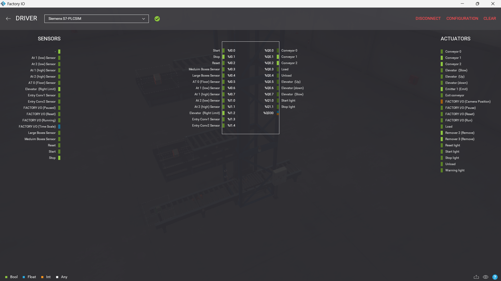
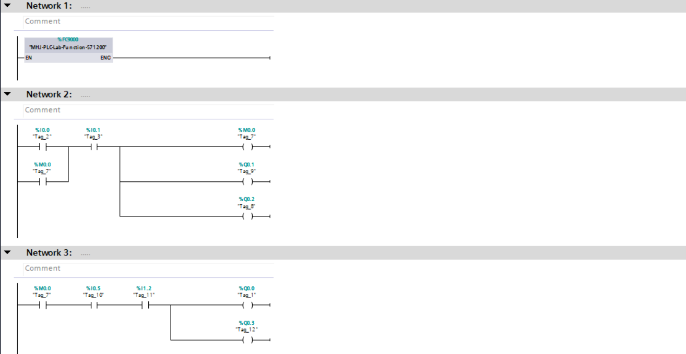
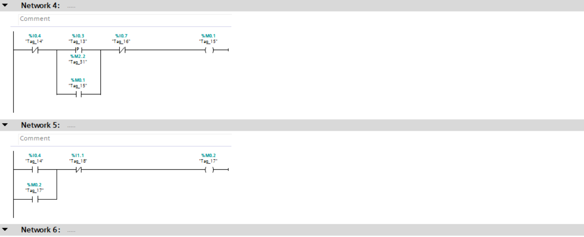
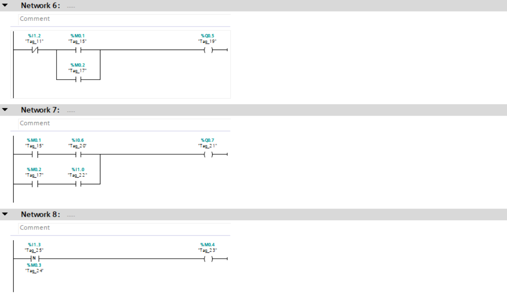
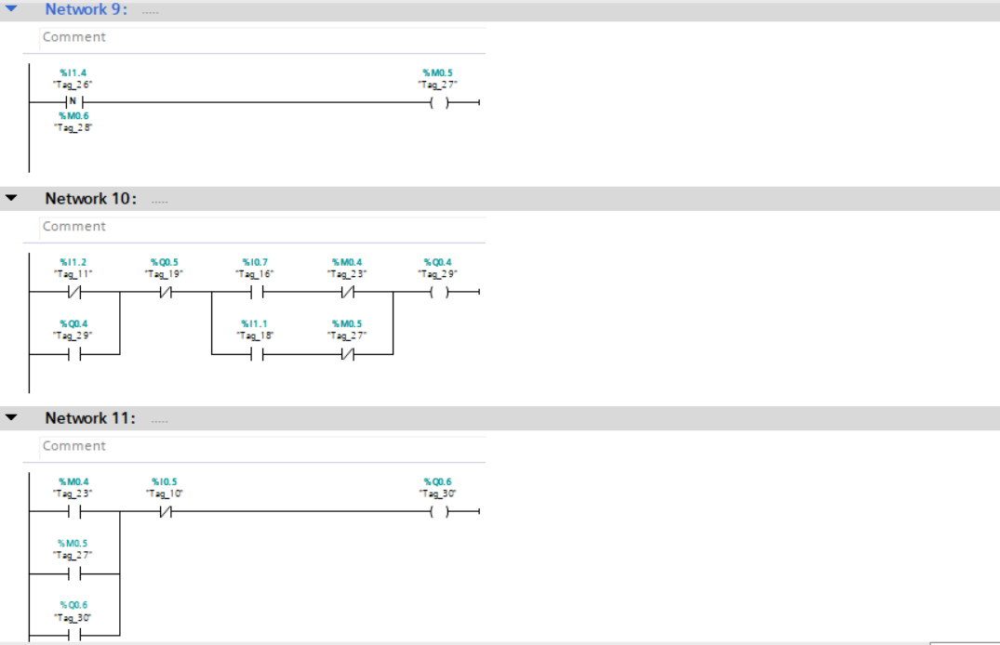
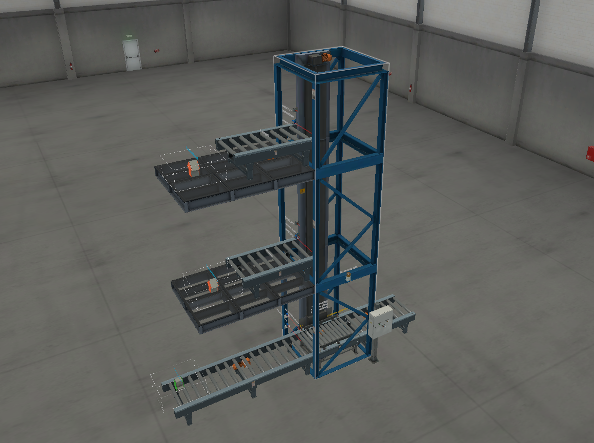

# Automated-Elevator-Control-and-Vertical-Transport-System

---

##  Project Overview

This project demonstrates an advanced industrial **Vertical Transport System** designed for precise and safe movement of materials between multiple levels.

The system simulates a real-world **industrial elevator unit** integrated within production lines, where accurate positioning, smooth motion, and safety interlocks are critical.

Developed using **Siemens TIA Portal** and simulated in **Factory I/O**.

---

##  Technology Stack

* **PLC Programming:** Siemens TIA Portal (S7-1200)
* **Simulation:** Factory I/O
* **Motion Control:** Elevator (Up / Down / Slow Mode)
* **Sensors:** Position Sensors + Limit Switches
* **Communication:** Siemens S7-PLCSIM

---

##  System Workflow

### 1. Position Detection

* Sensors continuously monitor elevator position:

  * Bottom (Floor)
  * Intermediate levels
  * Top limit

### 2. Command Processing

* PLC receives movement command (**Up / Down**)
* Evaluates current position before execution

### 3. Directional Movement

* Elevator moves:

  *  Upward when target is above
  *  Downward when target is below

### 4. Precision Control (Slow Mode)

* Activated near target position
* Ensures smooth stopping without overshoot

### 5. Position Locking

* Elevator stops exactly at sensor position
* Holds state until next command

### 6. Safety Interlocking

* Movement allowed only when:

  * No conflicting direction commands
  * Limits are not exceeded

---

##  Technical Highlights

* **Bidirectional Motion Control**
  Intelligent switching between Up and Down states

* **Precision Positioning System**
  Sensor-driven stopping with slow approach mode

* **Industrial Safety Logic**

  * Limit protection prevents mechanical damage
  * Mutual exclusion between Up/Down commands

* **Smooth Motion Profile**
  Reduced speed near end position for higher accuracy

---

##  Project Preview

###  System Configuration

###  Control Logic (Ladder Diagram)

###  Factory Scene

---

##  Demo Video

 [Watch elevator system demonstration](video.mp4)

---

##  How to Run

1. Open project in **TIA Portal**
2. Start **S7-PLCSIM**
3. Load Factory I/O scene
4. Connect using **Siemens S7 driver**
5. Switch PLC to **RUN mode**
6. Execute system commands
